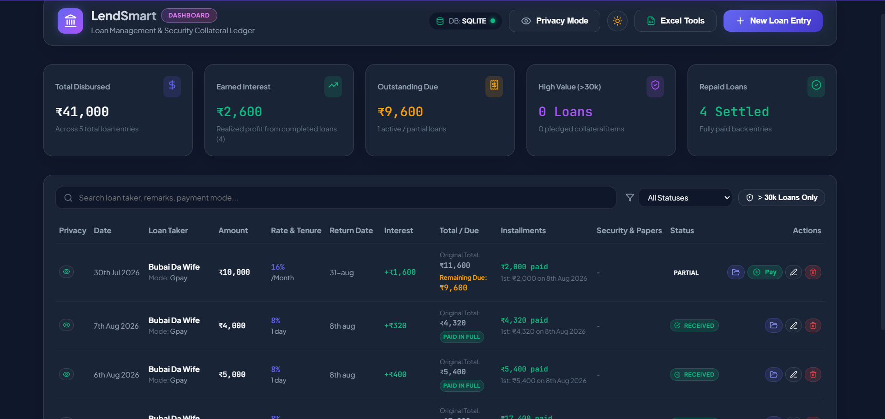
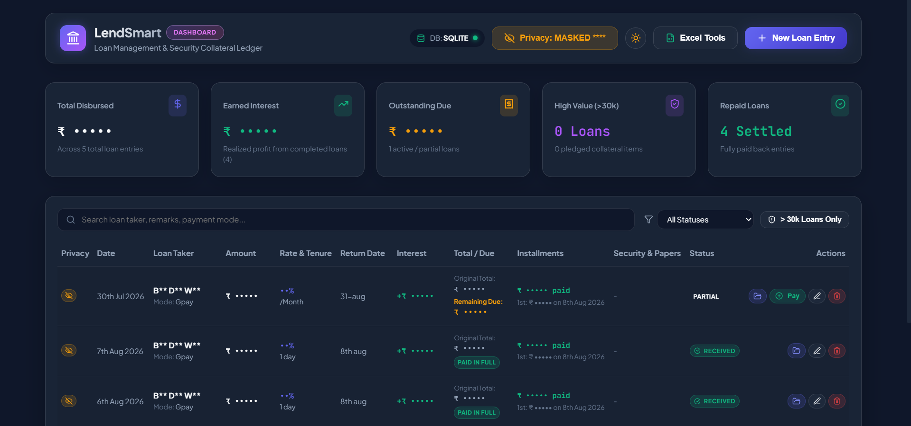
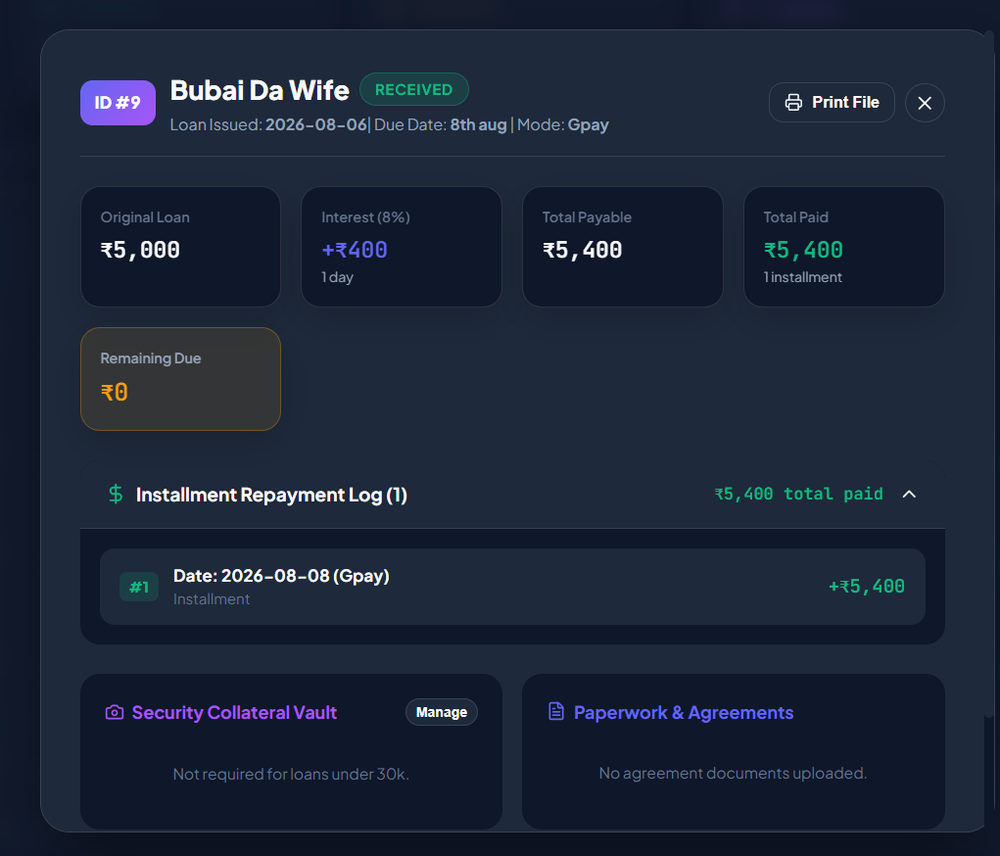
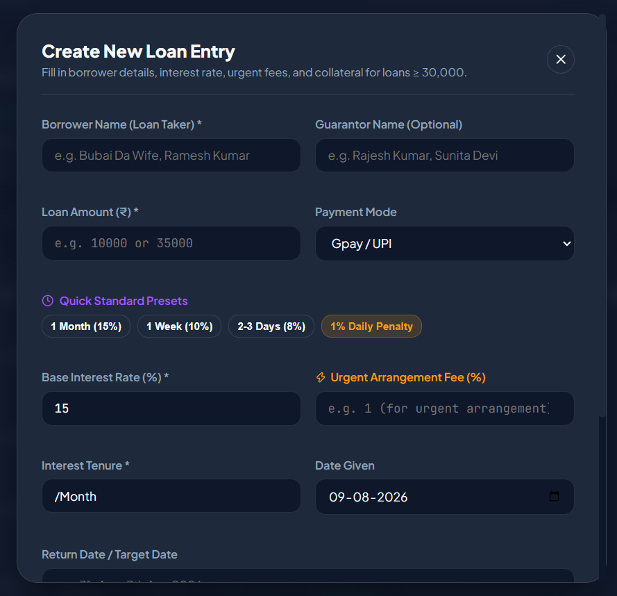
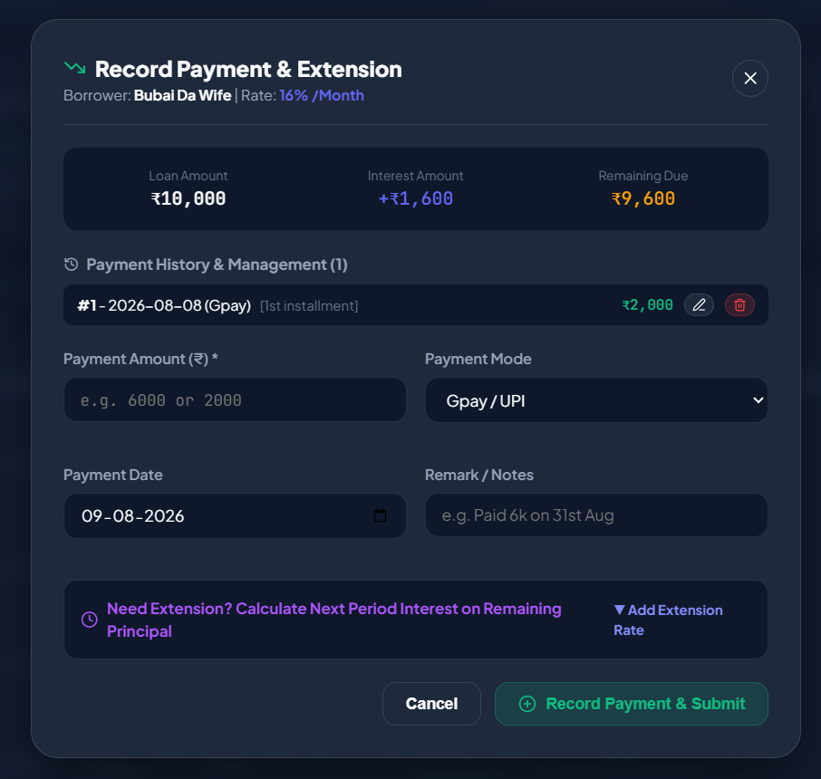
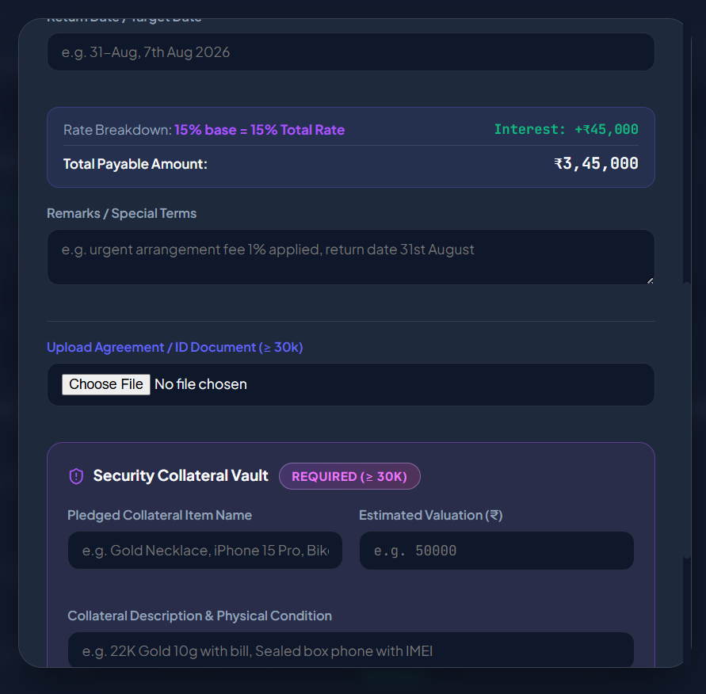
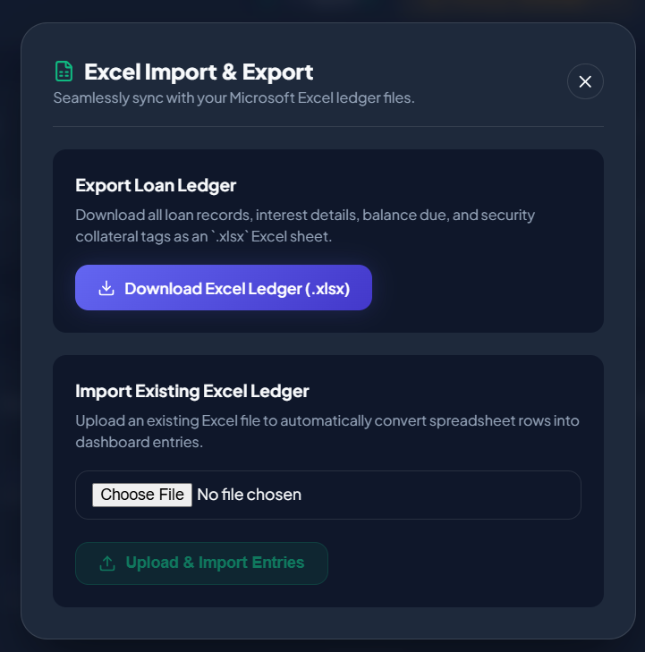
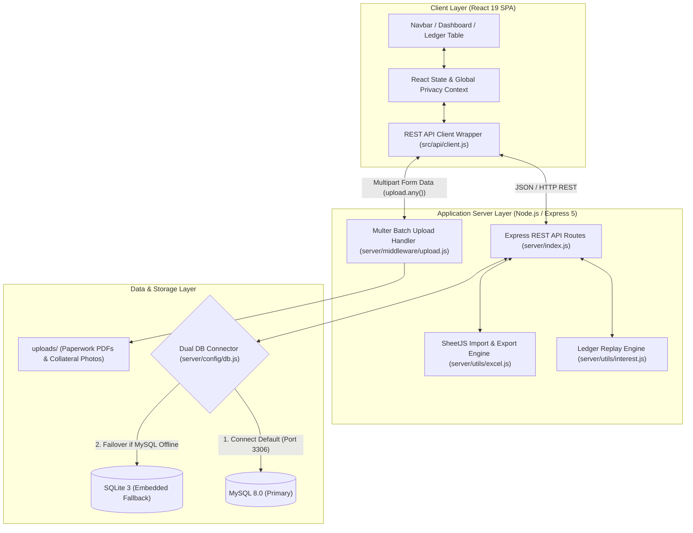

# ⚡ Modern Loan Accounting & Ledger Management System

A high-performance, full-stack financial ledger application designed for private lenders, micro-finance managers, and loan brokers. Built with **React 19**, **Vite 6**, **Node.js / Express 5**, and a **Dual Engine Database Architecture (SQLite Fallback + MySQL)** featuring **Glassmorphic UI**, **Global Privacy Mode**, **Master Loan File Inspection**, **Batch Multi-File Uploads (1-5 Docs & 1-10 Collateral Photos)**, **Interactive Fullscreen Lightbox Navigation**, and **Dynamic Tenure Extension Calculators**.

---

## 📸 Screenshots & Visual Walkthrough

### 1. Main Dashboard Ledger & Financial Overview
Full-stack financial dashboard featuring Realized Earned Interest KPIs, Outstanding Balance Tracking, Active Principal Balances, and Status Indicators.



---

### 2. Global & Row-Level Privacy Masking Mode (`👁️`)
Toggle privacy mode across the entire app or per borrower row to instantly mask sensitive names (`B** D** W**`) and figures (`₹ •••••`) when displaying your screen to clients or third parties.



---

### 3. Master Loan File Inspection Modal (`📁 File`)
Click the `📁` icon on any row to open the complete Master Loan File displaying borrower financial stats, **Guarantor Name**, 1-to-10+ installment history logs, security collateral photos, agreement paperwork PDF previews, and statement printing.



---

### 4. Batch Multi-File Uploads (1-5 Docs & 1-10 Collateral Photos at Once)
Upload **1 to 5 agreement / ID documents at once** and **1 to 10 security collateral photos at once** in a single file picker step. Details per photo are optional if uploading photos of the same pledged security item.



---

### 5. Installment Payment, Manual Status Toggle & Tenure Extension Calculator
Record partial repayments with live principal reduction previews. Features a **Manual Status Toggle** ("Mark Received" ↔ "Mark Active") with safety warning prompts and 1-click extension presets (`+1 Month`, `+1 Week`, `+2-3 Days`, `1% Daily Penalty`).



---

### 6. Security Collateral Vault & Interactive Fullscreen Lightbox
Carousel view (>3 photos), high-contrast zoom controls, image download triggers, and **Previous (`<`) / Next (`>`) floating navigation arrows** for cycling through images inside the fullscreen Lightbox.



---

### 7. Excel Import & Export Sync Modal
Download complete loan ledger databases to downloadable `.xlsx` spreadsheets or import existing Excel files into the database.



---

## 🌟 Key Features

- **📁 Batch Multi-File Upload Pipeline**:
  - **Agreement & ID Documents**: Upload **1 to 5 files simultaneously** in a single file picker step (`LoanFormModal` & `PaperworkModal`).
  - **Security Collateral Vault**: Upload **1 to 10 collateral photos simultaneously** without needing separate description/valuation fields per image. Real-time thumbnail preview grids showcase all selected photos.

- **🔍 Fullscreen Lightbox Zoom & Navigation Arrows**:
  - Dark glass Lightbox controls (`Zoom +`, `Zoom -`, `Reset ↺`, `Download 💾`, `Close X`) with high-contrast icon visibility in both Light and Dark UI modes.
  - **Floating Navigation Arrows (`<` `ChevronLeft` & `>` `ChevronRight`)**: Cycle through all collateral photos or paperwork documents directly inside the zoomed Lightbox without closing the modal.

- **🔄 Manual Status Toggle ("Mark Received" ↔ "Mark Active")**:
  - Direct status toggle inside the payment modal with a safety warning popup: *"Are you sure you want to mark this loan as RECEIVED?..."*
  - The ledger engine preserves manual user overrides (`received`, `forfeited`) across database syncs.

- **⚡ 4-Query Batch Pre-fetching Performance Engine**:
  - Solved the N+1 database query bottleneck in `GET /api/loans`. Replaced per-loan queries with **4-query batch pre-fetching** and `O(1)` hash-map indexing in memory.
  - Data loading for loan lists is **90% to 95% faster** (~5ms execution times).

- **💰 Flat & Partial Repayment Ledger Accounting**:
  - Automatically calculates initial total payable (`Principal + Interest`).
  - Supports partial payments: interest is paid off first, remaining payment reduces active principal balance.
  - Automatically tracks **Original Total** vs **Current Remaining Due**.

- **⏰ Tenure Extension & Penalty Rate Presets**:
  - 1-Click presets for extending remaining principal balance:
    - 🔘 `+1 Month (16% on balance)`
    - 🔘 `+1 Week (10% on balance)`
    - 🔘 `+2-3 Days (8.8% on balance)`
    - 🔘 `1% Daily Penalty (overdue)`

- **👁️ Global & Row-Level Privacy Mode**:
  - Navbar Eye toggle masks all sensitive figures (`₹ •••••`) and borrower names (`B** D** W**`).
  - Row-level Eye toggles allow unmasking individual borrower entries selectively.

- **🤝 Guarantor Name Tracking**:
  - Optional Guarantor field during loan creation/editing (`guarantor_name`).
  - Integrated into Master Loan File inspection modal (`📁` icon), main ledger table, and Excel reports.

- **🖨️ Single-Page PDF & Print Engine**:
  - Custom `@media print` styles ensure single-loan statements fit onto **exactly 1 clean page**.
  - Automatically names saved PDF files: `<Borrower_Name>_Loan_#<ID>.pdf`.

- **⚡ Dual Engine Database Architecture (MySQL + SQLite)**:
  - Connects to MySQL (`localhost:3306`) by default.
  - Automatic zero-config fallback to embedded local SQLite (`data/loan_dashboard.sqlite`) if MySQL is offline.

---

## 🛠️ Technology Stack

| Layer | Technology |
| :--- | :--- |
| **Frontend Framework** | React 19 SPA with Hooks, `useMemo`, & Context |
| **Build Tooling** | Vite v6.4.3 |
| **UI Styling** | Vanilla Modern CSS (Glassmorphism, CSS Variables, High-Contrast Dark Mode) |
| **Icons & Media** | Lucide React |
| **Backend Runtime** | Node.js (v18+) with Express v5.2 |
| **Database Engines** | Dual Engine: SQLite 3 (`sqlite3`) with fallback & MySQL (`mysql2`) |
| **File Storage** | Multer disk storage pipeline for documents & collateral photos (`uploads/`) |
| **Excel Integration** | SheetJS (`xlsx`) for import and export |

---

## 🏗️ System & Project Architecture

The system is built on a decoupled, 3-tier architecture: **Client Layer (SPA)**, **Application Server Layer (REST API & Ledger Engine)**, and **Data & Storage Layer (Dual-Engine Failover DB & Disk Storage)**.



---

## 📂 Project Directory Structure

```
loan/
├── .env                       # Environment variables (DB credentials, PORT)
├── .env.example               # Template for environment configuration
├── data/                      # Local SQLite storage directory
│   └── loan_dashboard.sqlite  # Embedded SQLite database file
├── docs/                      # Documentation & Screenshots
│   └── screenshots/           # Screenshot artifacts for documentation
├── dist/                      # Compiled production frontend bundle
├── uploads/                   # Uploaded paperwork PDFs & collateral photos
│   ├── collateral/            # Pledged collateral images
│   └── documents/             # Agreement & ID document files
├── server/                    # Node.js / Express backend
│   ├── config/
│   │   └── db.js              # Dual MySQL + SQLite database connector & migrations
│   ├── db/
│   │   └── schema.sql         # MySQL database schema definition
│   ├── middleware/
│   │   └── upload.js          # Multer multi-file upload handler
│   ├── utils/
│   │   ├── excel.js           # Excel export & parsing utilities
│   │   └── interest.js        # Flat & reducing interest accounting engine
│   └── index.js               # Express application REST API routes & server entry
├── src/                       # React frontend source code
│   ├── api/
│   │   └── client.js          # REST API client wrapper
│   ├── components/
│   │   ├── CollateralGalleryModal.jsx # Collateral gallery, carousel, & Lightbox
│   │   ├── ExcelModal.jsx             # Excel import/export modal
│   │   ├── FullLoanDetailsModal.jsx   # Master loan file inspection modal
│   │   ├── InstallmentModal.jsx       # Repayment, status toggle, & tenure calculator
│   │   ├── LoanFormModal.jsx          # Loan creation form with batch uploads
│   │   ├── LoanTable.jsx              # Main ledger table with useMemo search & privacy
│   │   ├── Navbar.jsx                 # Top bar with high-contrast privacy toggle
│   │   ├── PaperworkModal.jsx         # Agreement document viewer with Lightbox
│   │   └── StatsOverview.jsx          # Realized earned interest & KPI summary cards
│   ├── App.jsx                # Main React application component & state manager
│   ├── main.jsx               # React DOM entry point
│   └── index.css              # Glassmorphic design system & global CSS variables
├── package.json               # NPM scripts & dependencies
└── vite.config.js             # Vite build & dev server configuration
```

---

## ⚙️ Command Structure & Execution Guide

### 1. Installation

```bash
git clone https://github.com/your-username/loan.git
cd loan
npm install
```

### 2. Running in Development Mode

```bash
npm run dev
```

- **Frontend Dev Server**: `http://localhost:5173`
- **Backend Express API**: `http://localhost:5000`

### 3. Running Production Build

```bash
npm run build
npm start
```

Access the application in your browser at:
👉 **`http://localhost:5000`**

---

## 📡 REST API Endpoint Documentation

### Loans API (`/api/loans`)

| Method | Endpoint | Description |
| :--- | :--- | :--- |
| `GET` | `/api/loans` | Fetch all loans with pre-fetched installments, collateral items, and documents (Batch Optimized) |
| `GET` | `/api/loans/:id` | Fetch single loan details with replayed ledger state |
| `POST` | `/api/loans` | Create new loan entry (supports batch upload for 1-5 docs & 1-10 collateral photos) |
| `PUT` | `/api/loans/:id` | Update existing loan entry details (e.g. status override, return date, guarantor) |
| `DELETE` | `/api/loans/:id` | Delete loan entry and purge associated records |

### Collateral & Paperwork API

| Method | Endpoint | Description |
| :--- | :--- | :--- |
| `POST` | `/api/loans/:id/collateral` | Batch upload 1-10 collateral photo items |
| `PUT` | `/api/collateral/:id` | Update collateral item status (`pledged`, `returned`, `forfeited`, `sold`) |
| `DELETE` | `/api/collateral/:id` | Delete collateral item |
| `POST` | `/api/loans/:id/documents` | Batch upload 1-5 paperwork agreement documents |
| `DELETE` | `/api/documents/:id` | Delete document file |

---

## 💡 Accounting & Ledger Rules Summary

1. **Initial Disbursal**:
   - $\text{Interest Amount } (I_0) = \text{Loan Amount } (P_0) \times \left( \frac{\text{Base Rate} + \text{Urgent Fee}}{100} \right)$
   - $\text{Original Total Payable } (T_0) = P_0 + I_0$

2. **Partial Payments**:
   - Interest is paid off first: $I_{\text{paid}} = \min(\text{Amount Paid}, I_0)$.
   - Remaining payment reduces principal: $P_{\text{paid}} = \max(0, \text{Amount Paid} - I_{\text{paid}})$.
   - $\text{Remaining Principal Balance } (P_1) = P_0 - P_{\text{paid}}$.
   - $\text{Current Balance Due} = T_0 - \sum \text{Amount Paid}$.

3. **Tenure Extension Interest**:
   - Extended on remaining principal $P_1$:
     - **1 Month (16%)**: Extra Interest $= P_1 \times 0.16$
     - **1 Week (10%)**: Extra Interest $= P_1 \times 0.10$
     - **2-3 Days (8.8%)**: Extra Interest $= P_1 \times 0.088$
     - **1% Daily Penalty**: Extra Interest $= P_1 \times 0.01 \times \text{Days}$

4. **Status Preservation Rule**:
   - Manually set statuses (`received`, `forfeited`) are preserved by the ledger engine across recalculations.

---

## 📄 License & Usage Restrictions

This project is licensed for **Private & Personal Use Only**.

> [!CAUTION]
> **RESTRICTED NON-COMMERCIAL LICENSE**:
> - 🟢 **Allowed**: Personal use, private self-hosted deployment, educational research, and internal financial record keeping.
> - 🔴 **Strictly Forbidden**: Commercial resale, paid SaaS hosting, sub-licensing, distribution as a commercial software product, or any monetized commercial service without explicit permission from the project owner.


